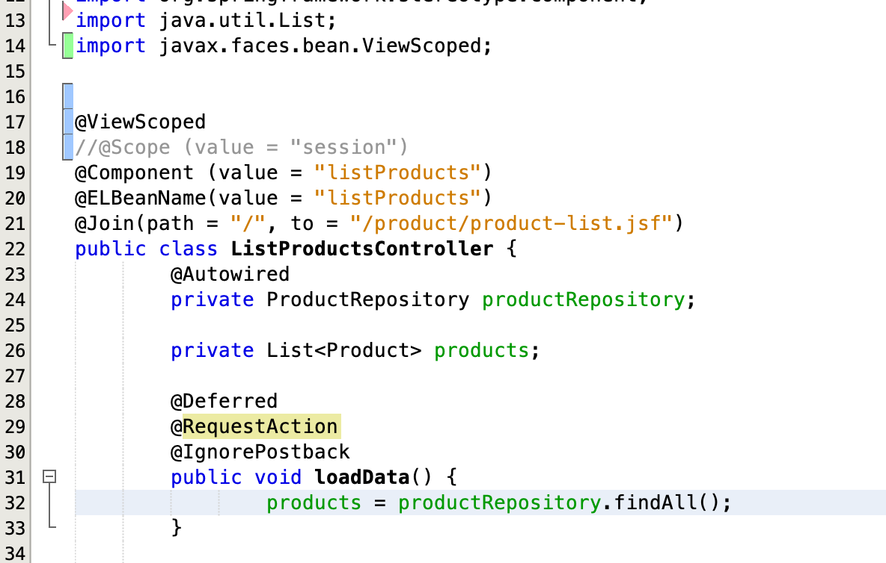

## How to use JoinFaces to integrate JSF with SpringBoot.

The example shows you how to use JoinFaces to integrate JSF with SpringBoot.

- Scenario 

I followed the article https://auth0.com/blog/developing-jsf-applications-with-spring-boot/ to integrate JSF with SpringBoot 1.5 successfully, but since some JSF anotations e.g. @ViewScoped does not exists in SpringBoot, therefore I could either

- [ ] implement @ViewScoped for SpringBoot by myself , read this link https://stackoverflow.com/questions/38292456/integrating-jsf-managed-bean-annotations-with-spring-boot

  or

- [ ] using JoinFaces to solve this problem, which i will show you in below steps 

  

- Howto

  Using JoinFaces 2.x, due to our SpringBoot is 1.x , for details, please refer to https://github.com/joinfaces/joinfaces/wiki/System-Requirements

  

  - [ ] import org.joinfaces.jsf-spring-boot-parent 2.x version

    

  

  

  - [ ] Using jsf-myfaces-spring-boot-starter for JSF myface implemenation, for details please refer to         https://github.com/joinfaces/joinfaces/wiki/Joinfaces-Starters-2.x

    

- [ ]  After importing dependency in pom.xml, you could use JSF annotations in Bean as below example

  

  